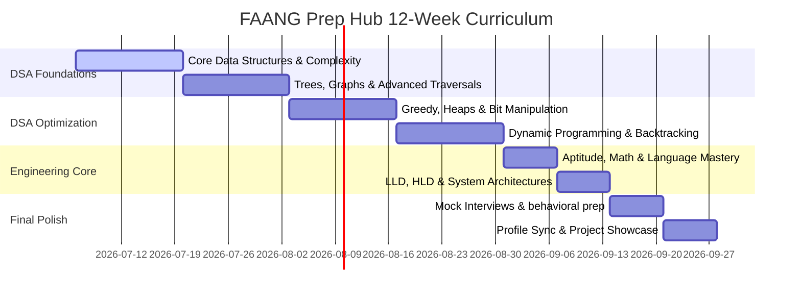

# 🚀 FAANG Prep Hub — Ultimate Candidate Preparation Engine


Welcome to the **FAANG Prep Hub**, a unified, premium workspace designed for ambitious software engineers. Preparing for technical interviews at world-class companies shouldn't mean toggling between twenty different browser tabs. This desktop platform integrates algorithmic practice, systems design, mock interviewing, sandbox coding, productivity tracking, and wellness tools into a single cohesive interface.

---

## 🎯 Targeted Top-Tier Companies

This dashboard was engineered to simulate and train candidates specifically for the evaluation standards of top-tier technology firms:


*   **Google**: Extreme emphasis on advanced algorithms, graphs, dynamic programming, and scalable system architectures.
*   **Meta (Facebook)**: Speed-based coding drills, focus on tree/graph traversals, binary search patterns, and fast-paced system design iterations.
*   **Apple**: Detailed hardware-software interaction, memory safety, system fundamentals, and clean object-oriented architecture.
*   **Netflix**: High-throughput distributed systems design, data flow design, sliding windows, arrays/hashing, and concurrency models.
*   **Amazon**: Customer-obsessed behavioral questions (Leadership Principles), graph modeling, greedy algorithms, and microservice structures.
*   **Microsoft**: Robust algorithmic thinking, design patterns, clean coding structures, strings, search, and trie structures.
*   **Stripe**: Heavy api integration modeling, modular design, clean code architecture, design & simulation, and transaction models.
*   **Tesla**: Embedded system optimizations, C++/Rust integration patterns, math and geometry topics, and multithreaded pipelines.

---

## 💡 Skills Curated & Mastered

By working through the modules within **FAANG Prep Hub**, you build comprehensive mastery across critical technical domains:

### 1. Data Structures & Algorithms (DSA)
*   **Core Traversals**: Depth-First Search (DFS), Breadth-First Search (BFS), Backtracking patterns.
*   **Optimization**: Dynamic Programming (DP), Greedy Algorithms, Monotonic Stacks, Sliding Window limits.
*   **Structural Representation**: Trees, Graphs, Tries, Disjoint-Set Union (Union-Find), Matrix grids, Intervals, and Segment Trees.
*   **Search & Sort**: Binary Search variants, Divide & Conquer, Heap sorting, Custom comparators.

### 2. Languages & Sandbox Execution
*   Syntax mastery across **13 coding languages**: Python, C++, Java, JavaScript, Go, Rust, TypeScript, C#, PHP, Swift, Kotlin, SQL, and Ruby.
*   Compilation speed and memory safety practices inside a secure local execution sandbox.

### 3. Quantitative & Reasoning Aptitude
*   **Mathematical Foundations**: Permutations, Combinations, Probability, Number Theory, Geometry.
*   **Logical Reasoning**: Puzzles, Analytical patterns, data sufficiency checks.

### 4. System & Software Design
*   **Low-Level Design (LLD)**: Object-Oriented Design (OOD), design patterns, modular interfaces.
*   **High-Level Design (HLD)**: Database scaling, concurrency models, secure caching.

---

## 🗺️ 12-Week Preparation Roadmap

To prepare systematically, follow this study timeline mapped directly to the hub's features. The complete, detailed curriculum sheet with weekly checkpoints and file references can be found in the **[roadmap.md](file:///D:/self%20develoupment/SELF%20DEVELOUPMENT/roadmap.md)** file.



| Phase | Duration | Core Focus Areas | Targeted Platform Tools |
| :--- | :--- | :--- | :--- |
| **Phase 1: DSA Foundations** | Weeks 1 - 4 | Big-O, Lists, Stacks, Sliding Windows, Trees, Graphs, BFS/DFS. | **DSA Prep**, **Algorithm Visualizer**, **Code Sandbox** |
| **Phase 2: DSA Optimization** | Weeks 5 - 8 | Heaps, Intervals, Greedy, DP patterns, Backtracking. | **DSA Prep**, **Activity Heatmap**, **Notes Workspace** |
| **Phase 3: Engineering Core** | Weeks 9 - 10 | Quantitative Math, Language specs, LLD, HLD, Vector Databases. | **Aptitude Trainer**, **Languages**, **AI Skills Corner** |
| **Phase 4: Final Polish** | Weeks 11 - 12 | Speed coding, STAR storytelling, profile syncing. | **Mock Interview**, **Company Guide**, **Profiles** |

---

## 🌟 Feature-by-Feature Detailed Breakdown

Here is a look inside the 18 integrated modules that form the heart of the workspace:

### 📈 1. Performance Dashboard
*   **File**: [pages_module/dashboard.py](file:///D:/self%20develoupment/SELF%20DEVELOUPMENT/pages_module/dashboard.py)
*   **Features**: Your preparation command center. Displays custom stats, streak meters, active daily milestones, and provides access to quick-launch bookmarks. Injects interactive visualizations showing your current progression split across various categories.

### 📊 2. DSA Prep
*   **File**: [pages_module/dsa.py](file:///D:/self%20develoupment/SELF%20DEVELOUPMENT/pages_module/dsa.py)
*   **Features**: Includes a categorized repository of 28 key DSA topics spanning over **340+ curated coding questions**. Track solved vs. unsolved questions, read explanation hints, and save progress.

### 🔍 3. Algorithm Visualizer
*   **File**: [pages_module/visualizer.py](file:///D:/self%20develoupment/SELF%20DEVELOUPMENT/pages_module/visualizer.py)
*   **Features**: Includes animated step-by-step visualizations of core search, sort, tree, and grid algorithms. Watch variables, pointers, and memory blocks update as the execution advances.

### 💻 4. Code Sandbox
*   **File**: [pages_module/sandbox.py](file:///D:/self%20develoupment/SELF%20DEVELOUPMENT/pages_module/sandbox.py)
*   **Features**: A local developer sandbox supporting multiple languages (Python, JavaScript, Go, etc.). Write, execute, and inspect standard input/output stream buffers in real time.

### 🏢 5. FAANG Company Guide
*   **File**: [pages_module/company_prep.py](file:///D:/self%20develoupment/SELF%20DEVELOUPMENT/pages_module/company_prep.py)
*   **Features**: Company-specific preparation dashboards. Details difficulty levels, historical focus areas (e.g. system design vs. coding), and typical interview loops for each firm.

### 🧠 6. Aptitude Trainer
*   **File**: [pages_module/aptitude.py](file:///D:/self%20develoupment/SELF%20DEVELOUPMENT/pages_module/aptitude.py)
*   **Features**: Interactive multiple-choice trainer loaded with mathematical, analytical, and logical questions to help clear candidate screening rounds.

### 💻 7. Learn Coding Languages
*   **File**: [pages_module/languages.py](file:///D:/self%20develoupment/SELF%20DEVELOUPMENT/pages_module/languages.py)
*   **Features**: Contains references, language cheatsheets, syntactic guides, and compilation settings for 13 modern development languages.

### 📅 8. Study Planner
*   **File**: [pages_module/study_planner.py](file:///D:/self%20develoupment/SELF%20DEVELOUPMENT/pages_module/study_planner.py)
*   **Features**: A personalized task scheduler and calendar. Set goals, track daily task checklists, and manage key revision topics.

### 🎯 9. Mock Interview
*   **File**: [pages_module/mock_interview.py](file:///D:/self%20develoupment/SELF%20DEVELOUPMENT/pages_module/mock_interview.py)
*   **Features**: Evaluates mock interview scripts, generates random algorithmic topics, asks problem-solving questions, and gives scoring evaluations based on coding readability and efficiency.

### 🚀 10. Project Showcase
*   **File**: [pages_module/project_showcase.py](file:///D:/self%20develoupment/SELF%20DEVELOUPMENT/pages_module/project_showcase.py)
*   **Features**: An interactive display board to document your projects, explain their system architecture, list tools used, and prepare explanations for system design interviews.

### 👥 11. Community Forum
*   **File**: [pages_module/community.py](file:///D:/self%20develoupment/SELF%20DEVELOUPMENT/pages_module/community.py)
*   **Features**: A simulated peer forum within the local environment. Create threads, ask coding questions, write answers, and collaborate.

### 🔌 12. Coding Profiles
*   **File**: [pages_module/profiles.py](file:///D:/self%20develoupment/SELF%20DEVELOUPMENT/pages_module/profiles.py)
*   **Features**: Links your real-world online coder profiles (LeetCode, GitHub, Codeforces) to feed dashboard telemetry directly from active API responses.

### 🔥 13. Activity Heatmap
*   **File**: [pages_module/heatmap.py](file:///D:/self%20develoupment/SELF%20DEVELOUPMENT/pages_module/heatmap.py)
*   **Features**: Visualizes preparation consistency using an interactive contribution grid (similar to GitHub commits). Tracks daily progress, exercises logged, and questions solved.

### 📝 14. Notes Workspace
*   **File**: [pages_module/notes.py](file:///D:/self%20develoupment/SELF%20DEVELOUPMENT/pages_module/notes.py)
*   **Features**: Personal markdown editor and vault. Keep logs of tricky problems, system designs, post-mortems, and key learnings.

### 💪 15. Fitness Tracker
*   **File**: [pages_module/fitness.py](file:///D:/self%20develoupment/SELF%20DEVELOUPMENT/pages_module/fitness.py)
*   **Features**: Interview prep is a marathon, not a sprint. Track workout schedules, daily physical activities, water intake, and hydration levels to keep your cognitive performance high.

### 🤖 16. AI Skills Corner
*   **File**: [pages_module/ai_skills.py](file:///D:/self%20develoupment/SELF%20DEVELOUPMENT/pages_module/ai_skills.py)
*   **Features**: Learn ML pipelines, vector databases, LLM tuning techniques, and prompting skills necessary for modern AI engineering interviews.

### 💬 17. User Comments & Workspace Feed
*   **File**: [pages_module/comments.py](file:///D:/self%20develoupment/SELF%20DEVELOUPMENT/pages_module/comments.py)
*   **Features**: Share how you are feeling, write notes, or log testimonials. Renders a beautiful glassmorphic comment feed, showing user feelings, user IDs, comments, and real-time timestamps. Prepopulated with mock comments to look realistic right out of the box.

### ⚙️ 18. Settings & Customization
*   **File**: Direct route in [app.py](file:///D:/self%20develoupment/SELF%20DEVELOUPMENT/app.py)
*   **Features**: Customize your avatar colors, username details, and upload custom wallpapers (PNG/JPG) to set your personal glassmorphic workspace aesthetic.

---

## 🔌 API Integrations Reference

The platform communicates with several external developer platforms to feed your dashboards live statistics. The integrations are managed under **[utils/api_helpers.py](file:///D:/self%20develoupment/SELF%20DEVELOUPMENT/utils/api_helpers.py)**:

| API Provider | Type | API Endpoint / GraphQL Queries | Data Fields Extracted |
| :--- | :--- | :--- | :--- |
| **ZenQuotes** | REST | `https://zenquotes.io/api/today` | Daily motivational quotes and author names (falls back to local seeded data on timeout). |
| **GitHub Users** | REST | `https://api.github.com/users/{username}` | Public repositories, bio details, followers, following, avatar url, blog, and account age. |
| **GitHub Repos** | REST | `https://api.github.com/users/{username}/repos` | Repository list, star counts, programming languages, descriptions, and update timestamps. |
| **GitHub GraphQL** | GraphQL | `https://api.github.com/graphql` | Contributions Collection calendar, commit numbers, issue submissions, and pull request counts. |
| **LeetCode** | GraphQL | `https://leetcode.com/graphql` | Matching User rankings, user avatar, country name, skill tags, problem solving statistics grouped by difficulty (Easy, Medium, Hard), and earned badges. |
| **Codeforces Info** | REST | `https://codeforces.com/api/user.info` | Handle metadata, current rating rank, maximum historical rating, max rank, and organization details. |
| **Codeforces Status** | REST | `https://codeforces.com/api/user.status` | Submission history, unique accepted problems solved count, and tagged problem category metrics. |

---

## 🏗️ System Architecture

The following diagram outlines the data flow between modules, utilities, database layer, and the core runner `app.py`:

```mermaid
graph TD
    %% Main Entrypoint
    App["app.py (Main Runner File)"]

    %% Front-End / Layout & Styling
    subgraph UI & Styling
        Styles["utils/styles.py"]
        APIHelpers["utils/api_helpers.py"]
    end

    %% Database Layer
    subgraph Storage Layer
        DB["db/database.py"]
        SQLite["db/faang_prep.db (SQLite File)"]
    end

    %% Data Content
    subgraph Data Content
        Questions["data/questions.py"]
    end

    %% Pages Modules
    subgraph Pages Modules (pages_module/)
        P_Dash["dashboard.py"]
        P_DSA["dsa.py"]
        P_Vis["visualizer.py"]
        P_Sand["sandbox.py"]
        P_Comp["company_prep.py"]
        P_Apt["aptitude.py"]
        P_Lang["languages.py"]
        P_Pln["study_planner.py"]
        P_Mock["mock_interview.py"]
        P_Proj["project_showcase.py"]
        P_Comm["community.py"]
        P_Prof["profiles.py"]
        P_Heat["heatmap.py"]
        P_Note["notes.py"]
        P_Fit["fitness.py"]
        P_AI["ai_skills.py"]
        P_Comm2["comments.py"]
        P_Auth["auth.py"]
    end

    %% Connections
    App --> P_Dash
    App --> P_DSA
    App --> P_Vis
    App --> P_Sand
    App --> P_Comp
    App --> P_Apt
    App --> P_Lang
    App --> P_Pln
    App --> P_Mock
    App --> P_Proj
    App --> P_Comm
    App --> P_Prof
    App --> P_Heat
    App --> P_Note
    App --> P_Fit
    App --> P_AI
    App --> P_Comm2
    App --> P_Auth

    %% Subsystem Connections
    Pages_Modules --> DB
    Pages_Modules --> Styles
    Pages_Modules --> APIHelpers
    Pages_Modules --> Questions
    DB --> SQLite
```

---

## 🚀 Getting Started

1.  **Install Required Dependencies**:
    Make sure you have python installed (version 3.10 to 3.12 recommended), then run:
    ```bash
    pip install -r requirements.txt
    ```

2.  **Run the Main Application Entrypoint**:
    ```bash
    streamlit run app.py
    ```

3.  **Browse the Dashboard**:
    Open the server URL shown in your terminal (typically `http://localhost:8501`) and start preparing!
