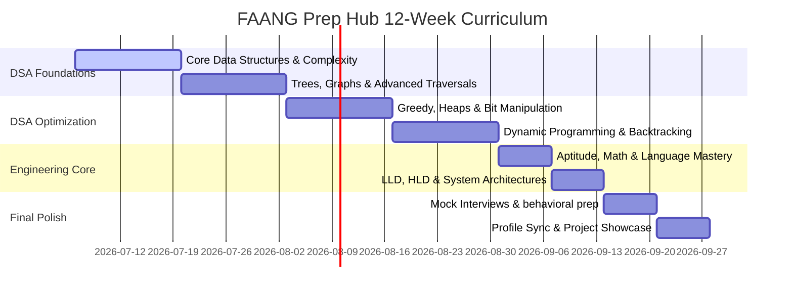

# 🗺️ FAANG Interview Preparation Roadmap

Prepare systematically for coding, systems design, and behavioral interviews at elite tech companies in **12 Weeks**. This curriculum is fully integrated with the tools and modules inside the **FAANG Prep Hub**.

---

## 📅 The 12-Week Preparation Timeline

---

## 📚 Weekly Learning & Practice Plan

### 🚀 Phase 1: Algorithmic Foundations (Weeks 1 - 4)

#### **Week 1 - 2: Core Data Structures & Complexity**
*   **Target Topics**: Arrays & Hashing, Two Pointers, Sliding Window, Stack.
*   **Skills Developed**: Space/Time Complexity analysis ($O(1)$ lookup strategies, fast/slow pointers, sliding window limits).
*   **FAANG Prep Hub Modules to Use**:
    *   [pages_module/dsa.py](file:///D:/self%20develoupment/SELF%20DEVELOUPMENT/pages_module/dsa.py): Practice *Arrays & Hashing* (22 questions) and *Sliding Window* (10 questions).
    *   [pages_module/visualizer.py](file:///D:/self%20develoupment/SELF%20DEVELOUPMENT/pages_module/visualizer.py): Visualize standard search algorithms and array sorting.

#### **Week 3 - 4: Trees, Graphs & Advanced Traversals**
*   **Target Topics**: Binary Trees, BSTs, Graphs, DFS, BFS, Linked Lists, Union-Find.
*   **Skills Developed**: Node recursion, graph traversals, adjacency list representations, cycle detection.
*   **FAANG Prep Hub Modules to Use**:
    *   [pages_module/dsa.py](file:///D:/self%20develoupment/SELF%20DEVELOUPMENT/pages_module/dsa.py): Solve *Trees* (20 questions) and *Graphs* (19 questions).
    *   [pages_module/sandbox.py](file:///D:/self%20develoupment/SELF%20DEVELOUPMENT/pages_module/sandbox.py): Write custom node classes and test recursive traversals.

---

### ⚡ Phase 2: DSA Optimization (Weeks 5 - 8)

#### **Week 5 - 6: Greedy, Heaps, Intervals & Bitwise Math**
*   **Target Topics**: Heap/Priority Queue, Intervals, Bit Manipulation, Greedy Algorithms.
*   **Skills Developed**: Optimal scheduling problems, min/max extraction, low-level bitwise masks, and coordinate scanning.
*   **FAANG Prep Hub Modules to Use**:
    *   [pages_module/dsa.py](file:///D:/self%20develoupment/SELF%20DEVELOUPMENT/pages_module/dsa.py): Practice *Heap / Priority Queue* (13 questions) and *Intervals* (7 questions).
    *   [pages_module/notes.py](file:///D:/self%20develoupment/SELF%20DEVELOUPMENT/pages_module/notes.py): Document tricky bit manipulation shortcuts.

#### **Week 7 - 8: Dynamic Programming & Backtracking**
*   **Target Topics**: Recursion & Memoization, 1D/2D Dynamic Programming, Backtracking.
*   **Skills Developed**: Subproblem division, state transition formulation, pruning search spaces.
*   **FAANG Prep Hub Modules to Use**:
    *   [pages_module/dsa.py](file:///D:/self%20develoupment/SELF%20DEVELOUPMENT/pages_module/dsa.py): Solve *Dynamic Programming* (28 questions) and *Backtracking* (14 questions).
    *   [pages_module/heatmap.py](file:///D:/self%20develoupment/SELF%20DEVELOUPMENT/pages_module/heatmap.py): Review consistency and activity logs to ensure daily target completion.

---

### 🏗️ Phase 3: Systems Design & Foundations (Weeks 9 - 10)

#### **Week 9: Quantitative Aptitude & Language Mastery**
*   **Target Topics**: Math & Geometry, Probability, Language runtime internals (Java JVM vs. C++ pointers vs. Python GIL).
*   **Skills Developed**: Clearing screening tests, quick math shortcuts, language-specific memory management.
*   **FAANG Prep Hub Modules to Use**:
    *   [pages_module/aptitude.py](file:///D:/self%20develoupment/SELF%20DEVELOUPMENT/pages_module/aptitude.py): Take mock quantitative quizzes.
    *   [pages_module/languages.py](file:///D:/self%20develoupment/SELF%20DEVELOUPMENT/pages_module/languages.py): Study runtime and syntax guides for your chosen language.

#### **Week 10: Systems Design (HLD & LLD)**
*   **Target Topics**: Object-Oriented Design (OOD), scalability, caching, load balancers, database choices (SQL vs NoSQL).
*   **Skills Developed**: Architecting large-scale services, object models, database normalization.
*   **FAANG Prep Hub Modules to Use**:
    *   [pages_module/dsa.py](file:///D:/self%20develoupment/SELF%20DEVELOUPMENT/pages_module/dsa.py): Complete *Object-Oriented Design* (12 questions).
    *   [pages_module/ai_skills.py](file:///D:/self%20develoupment/SELF%20DEVELOUPMENT/pages_module/ai_skills.py): Master vector databases and machine learning pipelines.

---

### 🏁 Phase 4: Final Polish & Run-Time Practice (Weeks 11 - 12)

#### **Week 11: Mock Interviews & Behavioral Prep**
*   **Target Topics**: Live mock execution, behavioral storytelling (using STAR technique).
*   **Skills Developed**: Communication, solving unseen problems under time pressure.
*   **FAANG Prep Hub Modules to Use**:
    *   [pages_module/mock_interview.py](file:///D:/self%20develoupment/SELF%20DEVELOUPMENT/pages_module/mock_interview.py): Run simulated mock interview sessions.
    *   [pages_module/company_prep.py](file:///D:/self%20develoupment/SELF%20DEVELOUPMENT/pages_module/company_prep.py): Study target company interview loops.

#### **Week 12: Profile Syncing & Portfolio Review**
*   **Target Topics**: Synchronizing external code platform ratings, final presentation of portfolio projects.
*   **Skills Developed**: Profile packaging, resume highlight review.
*   **FAANG Prep Hub Modules to Use**:
    *   [pages_module/profiles.py](file:///D:/self%20develoupment/SELF%20DEVELOUPMENT/pages_module/profiles.py): Sync ratings from GitHub, LeetCode, and Codeforces.
    *   [pages_module/project_showcase.py](file:///D:/self%20develoupment/SELF%20DEVELOUPMENT/pages_module/project_showcase.py): Organize and write descriptions for your showcase applications.
